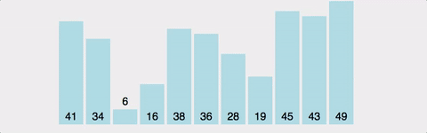

## 거품 정렬(Bubble Sort)

버블 정렬은 맨 끝부터 정렬하는 방식으로 첫번째 원소부터 인접한 원소를 비교하며 스왑한다.


<br>



```js
function bubbleSort(arr) {
  for (let x = 0; x < arr.length; x++) { // 1
    for (let y = 1; y < arr.length - x; y++) { // 2
      if (arr[y - 1] > arr[y]) {  // 3
        [arr[y - 1], arr[y]] = [ arr[y], arr[y - 1] ];
      }
    }
  }

  return arr;
}
```

1. 제외될 원소의 갯수를 의미합니다. 1회전이 끝난 후, 배열의 마지막 위치에는 가장 큰 원소가 위치하기 때문에 하나씩 증가시켜줍니다.
2. 원소를 비교할 index를 뽑을 반복문입니다. y는 현재 원소를 가리키고, y-1은 이전 원소를 가리키게 되므로, y는 1부터 시작하게 됩니다.
3. 현재 가르키고 있는 두 원소의 대소를 비교합니다. 해당 코드는 오름차순 정렬이므로 현재 원소보다 이전 원소가 더 크다면 이전 원소가 뒤로 가야하므로 서로 자리를 교환해줍니다.

<br>


<br>

## 시간복잡도

시간복잡도를 계산하면, `(n-1) + (n-2) + (n-3) + .... + 2 + 1 => n(n-1)/2`이므로, **O(n^2)** 입니다.  또한, 정렬이 돼있던 안돼있던, 2개의 원소를 비교하기 때문에 최선, 평균, 최악의 경우 모두 시간복잡도가 **O(n^2)** 으로 동일합니다.

<br>

### 장점

- 구현이 매우 간단하고, 소스코드가 직관적입니다.
- 정렬하고자 하는 배열 안에서 교환하는 방식이므로, 다른 메모리 공간을 필요로 하지 않습니다. => 제자리 정렬(in-place sorting)
- 안정 정렬(Stable Sort) 입니다.

<br>

### 단점

- 시간복잡도가 최악, 최선, 평균 모두 O(n^2)으로, 굉장히 비효율적입니다.
- 정렬 돼있지 않은 원소가 정렬 됐을때의 자리로 가기 위해서, 교환 연산(swap)이 많이 일어나게 됩니다.

<br>


### 개선
칵테일 셰이커(Cocktail Shaker) 정렬 (= 양방향 버블 정렬)

- 버블 정렬과는 달리 매 반복마다 배열의 순서를 바꾸어 정렬합니다.<br>
- 홀수 번째 반복은 가장 작은 요소를 맨 앞으로, 짝수 번째 반복은 가장 큰 요소를 맨 뒤로 정렬합니다. (또는 반대)<br>
- 시간복잡도는 최선의 경우 O(n)을 만족합니다!<br>
- 평균과 최악의 경우 여전히 O(n^2) 입니다..


<br>

---

### Reference & Additional Resources
- https://east-star.tistory.com/10

<br>

#### :: 답변할 수 있나요?

>- Bubble Sort에 대해 설명 할 수 있다.<br>
>- Bubble Sort을 구현할 수 있다.<br>
>- Bubble Sort의 시간복잡도를 계산할 수 있다.<br>