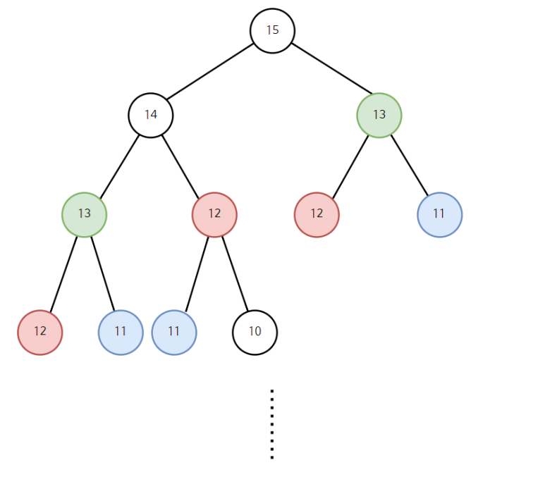

## 동적 계획법(Dynamic Programming)

하나의 문제는 단 한 번만 풀도록 하는 알고리즘  
`메모리`를 적절히 사용하여 수행 시간의 효율성을 비약적으로 향상하는 방법  
이미 계산된 결과(작은 문제)는 별도의 메모리 영역에 저장하여 다시 계산하지 않도록 함


### 필요한 예시

일반적으로 재귀 함수의 불필요한 연산을 줄이기 위해서 동적 계획법을 사용한다.
재귀 함수도 이전의 결과값을 활용해서 다음 결과를 계산한다는 점에서 동적 계획법과 비슷하다.  

하지만, 재귀 함수는 결과를 구한 동일한 문제에 대해 다시 계산을 하는 문제점이 있다.

대표적인 사례로 피보나치 수열이 있다.  
피보나치 수열은 특정한 숫자를 구하기 위해 그 앞에 있는 숫자와 두 칸 앞에 있는 숫자의 합을 구해야 한다.

#### 피보나치 예시 (재귀)

```js
  // 피보나치 수열의 점화식: D[i] = D[i - 1] + D[i - 2]

 const fibo = (n) => {
	if (n <= 1) return n;
	return fibo(n - 1) + fibo(n - 2);
}
```



크고 어려운 문제가 있으면 그것을 먼저 잘게 나누어서 해결한 뒤에 처리하여 나중에 전체의 답을 구하는 것  

다만 이 과정에서 `메모이제이션(Memoization)`이 사용된다는 점에 분할 정복과 다르다. 이미 계산한 결과는 배열에 저장함으로써 나중에 동일한 계산을 해야 할 때는 저장된 값을 단순히 반환하기만 하면 되는 것이다. 


#### 구현 방법

- Bottom-up : 작은 문제부터 차근차근 구하는 방법
- Top-down : 큰 문제를 풀다가 풀리지 않은 작은 문제가 있다면 그때 해결하는 방법 (재귀 방식)


#### Bottom-up
```js
const bottom_up_fibo = (n) => {
	const table = Array(n).fill(0); // 값을 저장하기 위한 테이블 선언
	table[0] = 1; // 초기값 선언
	table[1] = 2;
	
	for (let i = 2; i < n; i++) {
		table[i] = table[i - 1] + table[i - 2]; // 점화식을 통한 계산
	}
	return table[n - 1]; // 테이블의 마지막 요소에 저장된 값을 반환.
}
```


#### Top-Down 

```js
const top_down_fibo = (n) => {
	// 초기값인 0과 1에 도달하는 경우
	if (n < 2) {
		memo[n] = n;
		return n;
	}
	// 이미 계산된 결과가 있는 경우 해당 결과를 반환
	if (memo[n] > 0)
		return memo[n];
	memo[n] = top_down_fibo(n - 1) + top_down_fibo(n - 2);
	return memo[n];
}
```
위의 코드에서 일반적인 재귀 함수와 다른 부분은 다음과 같다.

```js
// 1. 이미 계산된 결과가 있는 경우 해당 결과를 반환
if (memo[n] > 0)
	return memo[n];
// 2. 계산 결과를 배열에 따로 저장
memo[n] = top_down_fibo(n - 1) + top_down_fibo(n - 2);
```

<br>
<br>
<br>


---

### Reference & Additional Resources
- https://80000coding.oopy.io/60c3d4d3-f569-4b47-bdde-9a65d30f3bc5