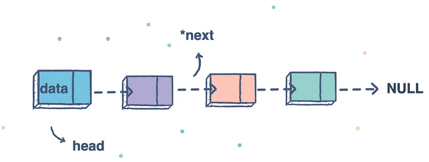

### List
---
List는 순서를 가지고 원소들을 저장하는 자료구조
같은 종류의 데이터를 순차적, 효율적으로 관리하기 위해 사용
Array List와 Linked List로 구현


### Array List
---
배열은 선언 시에 size를 정하여 해당 size만큼의 연속된 메모리를 할당 받아 data를 연속적/순차적으로 저장하는 자료구조

```
const arr = [3, 7, 4, 2, 6] // size가 5인 배열 선언
```

### Linked Array
--- 
Linked List는 Node라는 구조체가 연결되는 형식으로 데이터를 저장하는 자료구조
`떨어진 곳에 존재하는 데이터를 화살표로 연결해서 관리하는 데이터 구조`



연결리스트의 핵심은 node이며, node는 data를 담는 data field와 다음 노드를 알려주는 linked field로 구성된다.

[소스 코드](./code/linked_list.js)


---

### Array와 Linked Array

<details>
<summary>&nbsp; 배열과 연결리스트의 차이점</summary>

---

`Random Access (인접 메모리)`
> 💡 Random Access이란? <br/> 메모리에 저장된 데이터에 접근하려면 주소값을 알아야한다.<br/> 배열 변수는 자신이 할당받은 메모리의 첫 번째 주소값을 가리키는데 배열은 연속적/순차적으로 저장되기어 있기 때문에 첫 주소값만 알면 어떤 index에도 즉시 접근이 가능하다.

- 배열은 아무리 긴 배열이더라도 요소들을 연속된 물리주소 위치에 연이어 저장하고 <br/>연결리스트는 무작위 메모리 위치에 있고 포인터를 통해서 논리적으로 연결한다. 

- 따라서 **배열은** 특정 요소를 **O(1)** 의 시간복잡도로 접근하고 <br/>**연결 리스트**는 시작지점에서부터 순차 탐색해야기에 **O(N)** 의 시간복잡도가 소요된다.

- 배열은 특정 요소를 삽입, 제거하려면 요소들의 메모리 위치를 재조정해야하기에 O(N)이 필요
- 연결리스트는 요소를 삽입, 삭제할 때 노드의 포인터만 조정해주면 되기에 O(1)이 소요된다. 

<br/>

> **Array** 는 index로 빠르게 값을 찾는 것이 가능함<br/>
> **LinkedList** 는 데이터의 삽입 및 삭제가 빠름<br/>
> **ArrayList** 는 데이터를 찾는데 빠르지만, 삽입 및 삭제가 느림


---

</details>

<details>
<summary>&nbsp; 연결 리스트의 종류</summary>

---
- 단순 연결 리스트 한방향으로 데이터가 연결 된다.
- 원형 연결 리스트 맨 끝이 NULL이 아니라 첫 노드를 가리킨다.
- 이중 연결리스트 하나 노드에 head와 tail이 있어 앞뒤로 탐색을 할 수 있다.

---
</details>

<details>
<summary>&nbsp; 연결리스트에서 중간 요소을 어떻게 효율적으로 접근할 수 있는가?</summary>

---
- 2개의 포인터를 가지고 탐색을 하는데 하나는 2개 노드씩 이동하고 하나는 1개 노드씩 이동을 한다. 2개씩 이동하는 노드가 끝에 다달았을 때 1개씩 이동하는 노드의 위치가 중간 요소이다.
---
</details>


