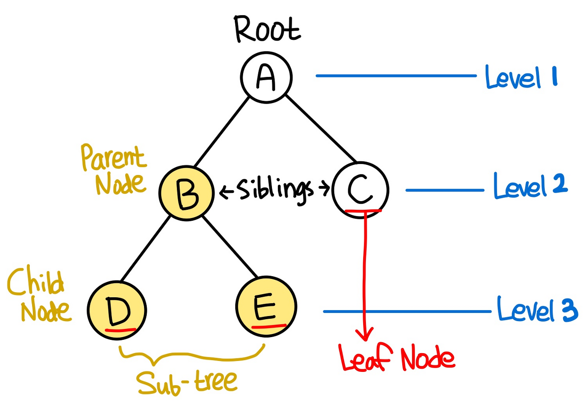
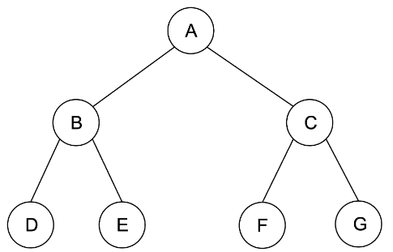

## 트리 (Tree)

Tree는 서로 연결된 Node의 계층형 자료구조로써,
모든 노드들은 0개 이상의 자식(Child) 노드를 갖고 있으며 보통 부모-자식 관계로 부른다.

트리의 각 요소들은 Node라고 부르고 가장 상위의 노드를 Root Node라고 부르며 root에서 시작하여 여러 개의 tree가 중첩되는 형태로 만들어진다. 

하나의 tree안에 여러 개의 Sub Tree가 존재하는데 자식 노드가 없는 트리 구조의 가장 하단에 있는 노드를 Leaf Node라고 말한다.

 
한 노드에 연결된 서브 트리의 개수를 차수라고 한다. 예를 들어서 B 노드의 차수는 2개이다. 만약에 한 트리 내의 차수가 모두 2개 이하라면 그 트리를 이진 트리(Binary Tree)라고 부른다.
 

현재 노드에 연결되어있는 상위 노드는 Parent Node이고 그 하위의 자식 노드는 Child Node이다. 같은 부모 노드를 갖는 노드는 형제 노드, 즉 Sibling Node이다. 이렇게 트리 구조의 용어는 정말로 가계도와 비슷하다.

 
Level은 루트 노드부터 해당 노드까지 경로를 찾는 데 방문한 총 노드의 수를 말한다. 트리의 최대 레벨 수는 트리의 height(높이) 혹은 depth(깊이)라고 한다. 위 그림의 트리 구조는 Level 1부터 Level 3까지 있고 트리의 높이는 3이다.

### 💡 트리의 몇 가지 특징

- 트리에는 사이클이 존재할 수 없다. (만약 사이클이 만들어진다면, 그것은 트리가 아니고 그래프다)
- 모든 노드는 자료형으로 표현이 가능하다.
- 루트에서 한 노드로 가는 경로는 유일한 경로 뿐이다.
- 노드의 개수가 N개면, 간선은 N-1개를 가진다.

## 트리 순회

#### 레벨 순회(level-order)
부모 노드부터 계층 별로 방문하는 방식이다. 
`A-B-C-D-E-F-G`

#### 전위 순회(pre-order)
각 부모 노드를 순차적으로 먼저 방문하는 방식이다. 
(부모 → 왼쪽 자식 → 오른쪽 자식) 
`A-B-D-E-C-F-G`

#### 중위 순회(in-order)
왼쪽 하위 트리를 방문 후 부모 노드를 방문하는 방식이다. 
(왼쪽 자식 → 부모 → 오른쪽 자식) 
`D-B-E-A-F-C-G`

#### 후위 순회(post-order)
왼쪽 하위 트리부터 하위를 모두 방문 후 부모 노드를 방문하는 방식이다. 
(왼쪽 자식 → 오른쪽 자식 → 부모) 
`D-E-B-F-G-C-A`

