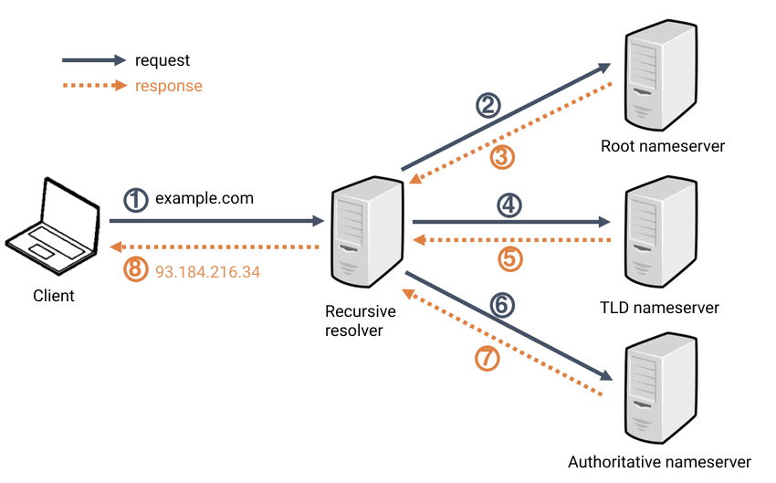

## DNS (Domain Name Server)

모든 통신은 IP를 기반으로 연결된다. 하지만 사용자에게 일일히 IP 주소를 입력하기란 UX적으로 좋지 않다.

때문에 DNS 가 등장 했으며 DNS 는 IP 주소와 도메인 주소를 매핑하는 역할을 수행한다.

## 도메인 주소가 IP로 변환되는 과정

1. CLient()브라우저가 설치된 컴퓨터는 www.example.com의 IP를 알아내기 위해서 가장 가까운 곳에 위치한 DNS에 www.example.com의 IP를 문의 한다.  
      
   - hosts 파일에는 로컬에서 직접 설정한 호스트 이름과 IP 주소를 매핑 하고 있습니다.  
   - 이떄 가장 가까운 Local DNS 서버가 IP를 알고 있다면 직접 IP 주소를 알려줍니다. 
2. 하지만 IP 주소를 모르면 루트 도메인 네임서버에게 문의 합니다.
    - DNS는 브라우저 캐시, 로컬 캐시(OS 캐시), 라우터 캐시, ISP(Internet Service Provider)캐시 순으로 확인 합니다.

3. Root DNS(.)는 도메인의 최상위 도메인이 `.com`인 것을 보고,
Root DNS에 등록된 .com 네임서버의 IP를 전달한다.
   - 모든 DNS에는 Root DNS의 주소가 포함 되어 있습니다.
   - 이를 통해 Root DNS에게 질의를 보내게 됩니다.
   - Root DNS는 도메인 주소의 최상위 계층을 확인하여 TLD(Top Level DNS)의 주소를 반환 합니다.

4. 그럼 다시 Local DNS는 .com 도메인을 관리하는 TLD 서버에게 문의한다.
   - Root DNS로 부터 반환받은 주소를 통해 요청을 보냅니다.
   

5. .com 네임서버는 .example.com의 네임서버 IP 주소를 알려준다.
    - TLD는 도메인에 권한이 있는 Authoritative DNS의 주소를 반환 합니다
6. Local DNS 서버는 .example.com의 네임서버에게 네이버의 웹서버인 www.의 IP를 문의한다.
7. example의 네임 서버는 www.example.com의 IP를 알려준다.
    - 도메인 이름에 대한 IP 주소를 반환 합니다
8.  최종적으로 Local DNS 서버는 example의 네임 서버에게서 알아온 www.example.com의 IP주소를 클라이언트에게 알려준다.

9. 클라이언트는 해당 IP주소에 특정 파일을 요청한다.

10. 클라이언트가 요청한 파일을 클라이언트에게 보여준다.

## 정리

- 디바이스는 hosts 파일을 열어 봅니다
- DNS는 캐시를 확인 합니다
- DNS는 Root DNS에 요청을 보냅니다
- DNS는 TLD에 요청을 보냅니다   
- DNS는 Authoritative DNS에 요청을 보냅니다
   

> 이때 요청을 보내는 DNS의 경우 재귀적으로 요청을 보내기 때문에 `DNS 리쿼서`라 지칭 하고 요청을 받는 DNS를 `네임서버`라 지칭 합니다

 
 
 
 

## DHCP

Dynamic Host Configuration Protocol 
자동으로 네임 서버 ,IP, 게이트웨이 주소 등을 할당해주는 프로토콜
IP를 자동으로 할당해주기 때문에 IP충돌을 사전에 방지 할 수 있다.

>DHCP 장점 
PC의 수가 많거나 PC 자체 변동사항이 많은 경우 IP 설정이 자동으로 되기 때문에 효율적으로 사용 가능하고, IP를 자동으로 할당해주기 때문에 IP 충돌을 막을 수 있습니다.