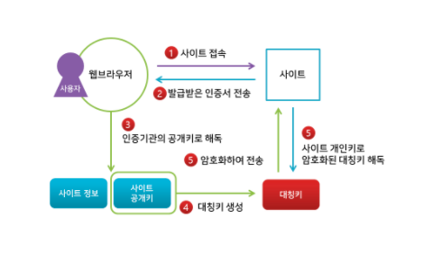

## HTTP
HyperText Transfer Protocol
 
인터넷 상에서 클라이언트와 서버가 자원을 주고 받을 때 쓰는 통신 규약

 

HTTP는 텍스트 교환이므로, 누군가 네트워크에서 신호를 가로채면 내용이 노출되는 보안 이슈가 존재한다.
이런 보안 문제를 해결해주는 프로토콜이 **'HTTPS'**

서버는 기본적으로 TCP 80포트에서 http연결을 기다린다. 
 

 

## HTTPS
HyperText Transfer Protocol Secure 
인터넷 상에서 정보를 암호화하는 SSL 프로토콜을 사용해 클라이언트와 서버가 자원을 주고 받을 때 쓰는 통신 규약

### HTTPS 통신 흐름

 

> 애플리케이션 서버(A)를 만드는 기업은 HTTPS를 적용하기 위해 공개키와 개인키를 만든다. 
> 신뢰할 수 있는 CA 기업을 선택하고, 그 기업에게 내 공개키 관리를 부탁하며 계약을 한다. 
 
> CA란? : Certificate Authority로, 공개키를 저장해주는 신뢰성이 검증된 민간기업

1. 클라이언트가 A서버에 요청을 보낸다. 
2. H클라이언트가 A서버에 요청을 보내는 과정에서 HTTPS 요청인 경우, CA기업이 A서버의 정보를 CA 기업의 개인키로 서명한다.
 

3. 클라이언트는 이 인증서가 진짜인지 브라우저의 내장된 CA들의 정보를 통해 인증서를 검증합니다.  인증서의 서명이 유효하면, 클라이언트는 해당 서버를 신뢰하게 됩니다.
    - CA 기업의 공개키는 브라우저가 이미 알고있다. 
    - A서버는 암호화된 대칭키를 자신의 개인키로 복호화 하여 클라이언트와 동일한 대칭키를 획득합니다.

4. CA의 인증을 받은 인증서들은 해당 서버의 개인키로 암호화가 돼어있다.

5. 클라이언트가 A서버와 Handshaking 과정에서 pre-master-secret-key를 생성한 뒤, 이를 A서버의 공개키로 암호화하여 서버로 보냅니다. 서버는 자신의 개인키로 이 암호문을 복호화하여 pre-master-secret-key를 획득합니다.

    - 클라이언트, 서버는 각각 pre-master-secret-key를 master-secret-key으로 만든다.
    - master-secret-key 를 통해 session-key를 생성하고 이를 이용하여 대칭키 방식으로 통신한다.

6. 각 통신이 종료될 때마다 session-key를 파기합니다.

