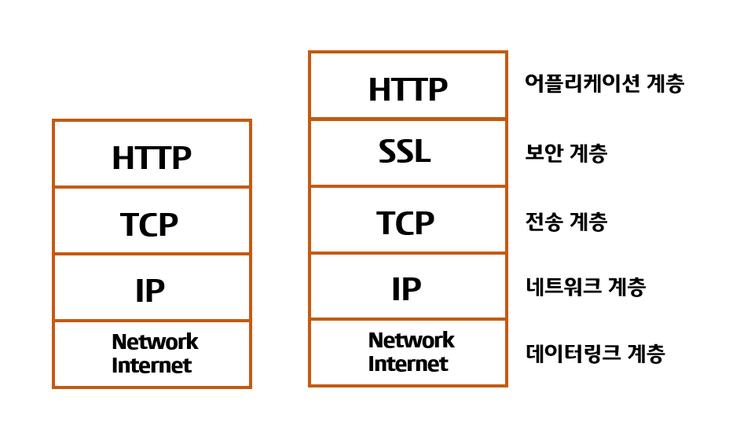

## TCP

신뢰성 있는 데이터 전송을 목적으로 하는 전송계층의 프로토콜 
TCP는 기본적으로 unreliable network에서, reliable network를 보장할 수 있도록 하는 프로토콜
 

연결지향적이며, 전이중 방식이다.
신뢰성있는 통신을 위해 오류,흐름,혼잡제어를 제공한다.

> reliable network를 보장한다는 것은 4가지 문제점 존재  
> 손실 : packet이 손실될 수 있는 문제 
순서 바뀜 : packet의 순서가 바뀌는 문제 
Congestion : 네트워크가 혼잡한 문제 
Overload : receiver가 overload 되는 문제 

### 흐름제어 (Flow Control)
흐름제어란 각 상대측 노드의 데이터 처리 속도 차이를 해결하는 방법

### 혼잡제어 (Congestion Control)
혼잡제어란 네트워크 상황에 맞게 데이터의 양을 제어하는 방법