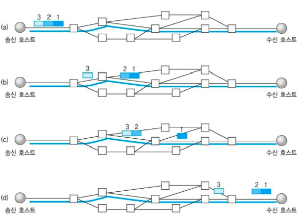
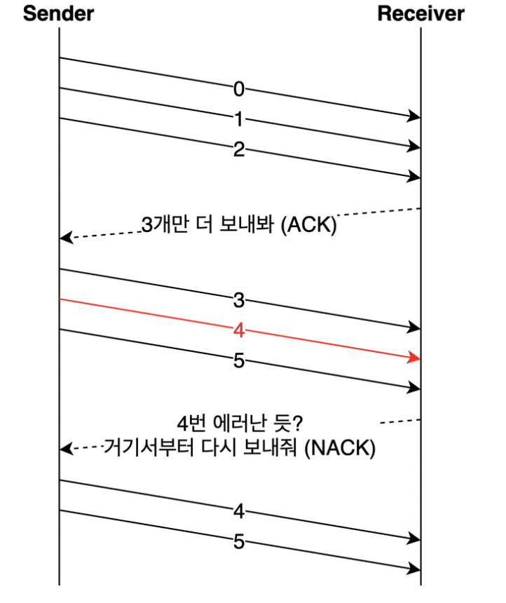
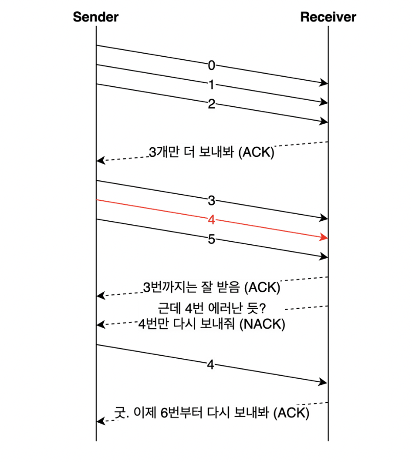
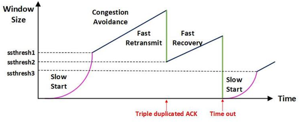

### 들어가기전..

#### OSI 7layer와 TCP/IP 4layer  

#### TCP통신이란?  
전송계층의 프로토콜로 네트워크 통신에서 신뢰적인 연결방식  
TCP는 기본적으로 unreliable network에서, reliable network를 보장할 수 있도록 하는 프로토콜  

- reliable network를 보장한다는 것은 4가지 문제점 존재  
  - 손실 : packet이 손실될 수 있는 문제 
  - 순서 바뀜 : packet의 순서가 바뀌는 문제 
  - Congestion : 네트워크가 혼잡한 문제 
  - Overload : receiver가 overload 되는 문제 

일반적으로 TCP와 IP를 함께 사용하는데, IP가 데이터의 배달을 처리한다면 TCP는 `패킷`을 추적 및 관리하게 된다.  

 

### TCP 특징

- 연결 지향 방식으로 패킷 교환 방식을 사용한다(가상 회선 방식이 아님).
- 3-way handshaking과정을 통해 연결을 설정하고 4-way handshaking을 통해 해제한다.
- 흐름 제어 및 혼잡 제어.
- 높은 신뢰성을 보장한다.
- UDP보다 속도가 느리다.
- 전이중(Full-Duplex), 점대점(Point to Point) 방식.

TCP가 연결 지향 방식이라는 것은 패킷을 전송하기 위한 논리적 경로를 배정한다는 말입니다. 
그리고 3-way handshaking과정은 목적지와 수신지를 확실히 하여 정확한 전송을 보장하기 위해서
세션을 수립하는 과정을 의미합니다.
TCP가 이러한 특징을 지니는 이유는 간단명료합니다.

바로 TCP는 연결형 서비스로 신뢰성을 보장하기 때문입니다. 그래서 3-way handshaking의 과정도 사용하는 것이고,
 데이터의 흐름제어나 혼잡 제어와 같은 기능도 합니다. 하지만 이러한 기능때문에 UDP보다 속도가 느리게 됩니다.
(이러한 기능은 CPU를 사용하기 때문에 속도에 영향을 주는 것입니다.)
그렇기에 TCP는 연속성보다 신뢰성있는 전송이 중요할 때에 사용하는 프로토콜로 예를 들면 파일 전송과 같은 경우에 사용됩니다!

 
 
 

### 흐름제어, 오류제어, 혼잡제어
--- 

&nbsp; 흐름제어 

----
흐름제어란 각 상대측 노드의 데이터 처리 속도 차이를 해결하는 방법
수신측이 송신측보다 데이터 처리 속도가 빠르면 문제없지만, 송신측의 속도가 빠를 경우 문제가 생긴다.

수신측에서 제한된 저장 용량을 초과한 이후에 도착하는 데이터는 손실 될 수 있으며, 만약 손실 된다면 불필요하게 응답과 데이터 전송이 송/수신 측 간에 빈번히 발생한다.

이러한 위험을 줄이기 위해 송신 측의 데이터 전송량을 수신측에 따라 조절해야한다.

 

### 해결 방법
  

- Stop and Wait : 매번 전송한 패킷에 대해 확인 응답을 받아야만 그 다음 패킷을 전송하는 방법

 
 
 

- Sliding Window (Go Back N ARQ) :  송신 측이 수신 측에서 받은 윈도우 크기를 참고해서 데이터의 흐름을 제어하는 방식

  - 수신측에서 설정한 윈도우 크기만큼 송신측에서 확인응답없이 세그먼트를 전송할 수 있게 하여 데이터 흐름을 동적으로 조절하는 제어기법

  - 목적 : 전송은 되었지만, acked를 받지 못한 byte의 숫자를 파악하기 위해 사용하는 protocol

  - LastByteSent - LastByteAcked <= ReceivecWindowAdvertised

  - (마지막에 보내진 바이트 - 마지막에 확인된 바이트 <= 남아있는 공간) == (현재 공중에 떠있는 패킷 수 <= sliding window)

동작방식

- 최초 윈도우 사이즈 = 7(0~6 까지) 설정
- 송신자(sender)는 수신자(receiver)의 응답(ack)를 받기 전까지 데이터를 전송
- 수신자(receiver)는 응답(ack)를 송신자(sender)에게 보내면, 슬라이딩 윈도우 사이즈를 충족할 수 있게 윈도우를 옆으로 옮기며 데이터를 모두 전송할때까지 반복
윈도우 크기 = 수신 측이 한번에 처리할 수 있는 데이터의 양으로 3 way handshake할 때 송신 측에 전달되며 이후 수신 측의 버퍼에 남아있는 공간에 따라 변한다.

 
 
 

----

&nbsp; 오류제어 

--- 
TCP는 통신 중에 오류가 발생하면 해당 데이터를 재전송한다.

즉, 재전송 기반 오류 제어 ARQ(Automatic Repeat Request)를 사용한다.

재전송은 비효율적이므로 적을수록 좋다.

오류를 알 수 있는 방법
- 송신 측이 ACK를 받지 못함 (데이터 유실 or ACK 유실 )
- 중복된 ACK 수신
- 수신 측이 NACK(부정응답)을 보냄

### 해결 방법

- Go Back N : 오류 발생 지점부터 재전송

 
 
 

- Selective Repeat : 오류가 발생한 데이터만 재전송하는 방식

 
 
 

--- 

&nbsp; 혼잡제어

---
혼잡제어란 네트워크 상황에 맞게 데이터의 양을 제어하는 방법

송신측의 데이터는 지역망이나 인터넷으로 연결된 대형 네트워크를 통해 전달된다. 
만약 한 라우터에 데이터가 몰릴 경우, 자신에게 온 데이터를 모두 처리할 수 없게 된다. 
이런 경우 호스트들은 또 다시 재전송을 하게되고 결국 혼잡만 가중시켜 오버플로우나 데이터 손실을 발생시키게 된다. 
따라서 이러한 네트워크의 혼잡을 피하기 위해 송신측에서 보내는 데이터의 전송속도를 강제로 줄이게 되는데, 이러한 작업을 혼잡제어라고 한다.

또한 네트워크 내에 패킷의 수가 과도하게 증가하는 현상을 혼잡이라 하며, 혼잡 현상을 방지하거나 제거하는 기능을 혼잡제어라고 한다.

흐름제어가 송신측과 수신측 사이의 전송속도를 다루는데 반해, 혼잡제어는 호스트와 라우터를 포함한 보다 넓은 관점에서 전송 문제를 다루게 된다.

- AIMD(Additive Increase / Multiplicative Decrease)
  - 처음에 패킷을 하나씩 보내고 이것이 문제없이 도착하면 window 크기(단위 시간 내에 보내는 패킷의 수)를 1씩 증가시켜가며 전송하는 방법
  - 패킷 전송에 실패하거나 일정 시간을 넘으면 패킷의 보내는 속도를 절반으로 줄인다.
  - 공평한 방식으로, 여러 호스트가 한 네트워크를 공유하고 있으면 나중에 진입하는 쪽이 처음에는 불리하지만, 시간이 흐르면 평형상태로 수렴하게 되는 특징이 있다.
  - 문제점은 초기에 네트워크의 높은 대역폭을 사용하지 못하여 오랜 시간이 걸리게 되고, 네트워크가 혼잡해지는 상황을 미리 감지하지 못한다. 즉, 네트워크가 혼잡해지고 나서야 대역폭을 줄이는 방식이다.

- Slow Start (느린 시작)
  - AIMD 방식이 네트워크의 수용량 주변에서는 효율적으로 작동하지만, 처음에 전송 속도를 올리는데 시간이 오래 걸리는 단점이 존재했다.
  - Slow Start 방식은 AIMD와 마찬가지로 패킷을 하나씩 보내면서 시작하고, 패킷이 문제없이 도착하면 각각의 ACK 패킷마다 window size를 1씩 늘려준다. 즉, 한 주기가 지나면 window size가 2배로 된다.
  - 전송속도는 AIMD에 반해 지수 함수 꼴로 증가한다. 대신에 혼잡 현상이 발생하면 window size를 1로 떨어뜨리게 된다.
  - 처음에는 네트워크의 수용량을 예상할 수 있는 정보가 없지만, 한번 혼잡 현상이 발생하고 나면 네트워크의 수용량을 어느 정도 예상할 수 있다.
  - 그러므로 혼잡 현상이 발생하였던 window size의 절반까지는 이전처럼 지수 함수 꼴로 창 크기를 증가시키고 그 이후부터는 완만하게 1씩 증가시킨다.

- Fast Retransmit (빠른 재전송)
  - 빠른 재전송은 TCP의 혼잡 조절에 추가된 정책이다.
  - 패킷을 받는 쪽에서 먼저 도착해야할 패킷이 도착하지 않고 다음 패킷이 도착한 경우에도 ACK 패킷을 보내게 된다.
  - 단, 순서대로 잘 도착한 마지막 패킷의 다음 패킷의 순번을 ACK 패킷에 실어서 보내게 되므로, 중간에 하나가 손실되게 되면 송신 측에서는 순번이 중복된 ACK 패킷을 받게 된다. 이것을 감지하는 순간 문제가 되는 순번의 패킷을 재전송 해줄 수 있다.
  - 중복된 순번의 패킷을 3개 받으면 재전송을 하게 된다. 약간 혼잡한 상황이 일어난 것이므로 혼잡을 감지하고 window size를 줄이게 된다.

- Fast Recovery (빠른 회복)
  - 혼잡한 상태가 되면 window size를 1로 줄이지 않고 반으로 줄이고 선형증가시키는 방법이다. 이 정책까지 적용하면 혼잡 상황을 한번 겪고 나서부터는 순수한 AIMD 방식으로 동작하게 된다.

---

 
 
 

### Reference 
- https://mangkyu.tistory.com/15

- https://github.com/gyoogle/tech-interview-for-developer/blob/master/Computer%20Science/Network/TCP%20(%ED%9D%90%EB%A6%84%EC%A0%9C%EC%96%B4%ED%98%BC%EC%9E%A1%EC%A0%9C%EC%96%B4).md
