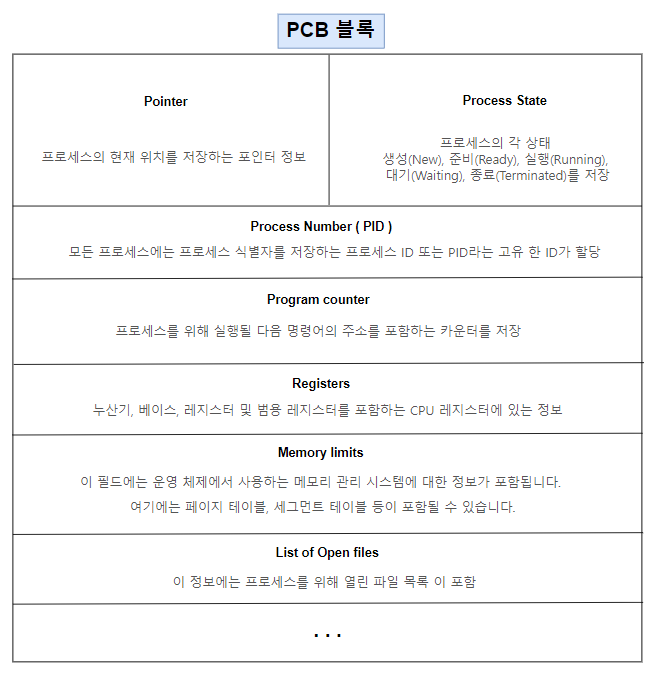

## PCB(Process Control Block)란?

PCB는 운영체제가 프로세스를 표현한 자료구조이다. 

각 프로세스가 생성될때마다 고유의 PCB가 생성되고, 프로세스가 완료되면 PCB 는 제거된다.  
프로세스 간 문맥교환이 일어나면서, 프로세스는 진행하던 작업들을 PCB에 저장하고, 이후에 자신의 순서가 왔을 때 이어서 처리한다.

이때, CPU는 각 프로세스들이 누군지 알아야 관리가 가능함

프로세스들의 특징을 갖고있는 것이 바로 `Process Metadata`

- Process Metadata
- Process ID
- Process State
- Process Priority
- CPU Registers
- Owner
- CPU Usage
- Memeory Usage

 

#### 프로그램이 프로세스되면서 일어나는 일

> 프로그램 실행 → 프로세스 생성 → 프로세스 주소 공간에 (코드, 데이터, 스택) 생성 
→ 이 프로세스의 메타데이터들이 PCB에 저장

---

 
 
 

## 문맥교환(Context Switch)

하나의 프로세스가 이미 CPU 를 사용중인 상태에서 다른 프로세스가 CPU 를 사용하기 위해 이전 프로세스의 상태를 저장하고 새로운 프로세스의 상태를 적재하는 것.

ex) 카카오톡을 켜놓고 유튜브로 노래를 들으면서 웹서핑을 하는 것은 사용자 입장에서 동시에 일어나는 일처럼 보이지만 실제로는 그렇지 않음.

현재 프로세스 A 가 CPU 를 사용하고 있는 상황에서 CPU 사용시간이 끝나, 다음 프로세스에게 CPU 를 넘겨주어야 합니다. 스케줄링 알고리즘에 의해 다음 CPU 를 받을 프로세스B 가 선택되었고, 타이머 인터럽트가 발생해 CPU 제어권이 운영체제 커널에 넘어가게 됩니다.

#### Context Switching의 OverHead란?
overhead는 과부하라는 뜻으로 보통 안좋은 말로 많이 쓰인다.

하지만 프로세스 작업 중에는 OverHead를 감수해야 하는 상황이 있다.

> 프로세스를 수행하다가 입출력 이벤트가 발생해서 대기 상태로 전환시킴
이때, CPU를 그냥 놀게 놔두는 것보다 다른 프로세스를 수행시키는 것이 효율적
즉, CPU에 계속 프로세스를 수행시키도록 하기 위해서 다른 프로세스를 실행시키고 Context Switching 하는 것

CPU가 놀지 않도록 만들고, 사용자에게 빠르게 일처리를 제공해주기 위한 것이다.